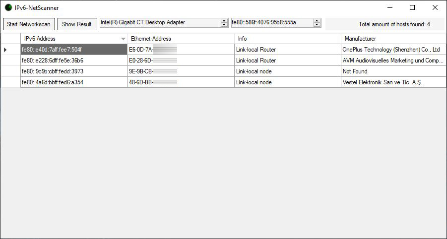

# IPv6 Network Scanner
This is a fast, simple and super lightweight IPv6 network scanner with graphical interface written with C#, [SharpPcap](https://github.com/chmorgan/sharppcap) and [PacketNet](https://github.com/chmorgan/packetnet).
A very helpful article about IPv6 address scanning can be found here: [Sanning IPv6 Networks](https://www.dionach.com/blog/scanning-ipv6-networks/)

## Download IPv6 Network Scanner
**Make sure you have [.NET 4.8.0](https://dotnet.microsoft.com/download/dotnet-framework) and [Npcap](https://nmap.org/download.html) installed!** 
You can download the already compiled IPv6-Scanner (latest working) [here](https://github.com/MonsterSchool/IPv6-NetScanner/releases/download/v.0.9.2.2/IPv6-NetScanner.exe) (releases). 

## Screenshot

## The Networkscan
(coming soon)
The entire scanning process takes a maximum of 8 seconds. Depending on the response, the different interfaces are assigned to the scopes.

## MAC-Address Vendor Database
The Database-File can be downloaded here: [Link](https://maclookup.app/downloads/cisco-vendor-macs-xml-database) 

## Copyright
The contents and works in this software created by the software operators are subject to German copyright law. The reproduction, editing, distribution and any kind of use outside the limits of copyright law require the written consent of the respective author or creator. Downloads and copies of this software are only permitted for private, non-commercial use.

Insofar as the content on this software was not created by the operator, the copyrights of third parties are observed. In particular, third-party content is identified as such. Should you nevertheless become aware of a copyright infringement, please inform us accordingly. If we become aware of any infringements, we will remove such contents immediately.

Source: [eRecht24.de](https://www.e-recht24.de/)
Cheers 👀
